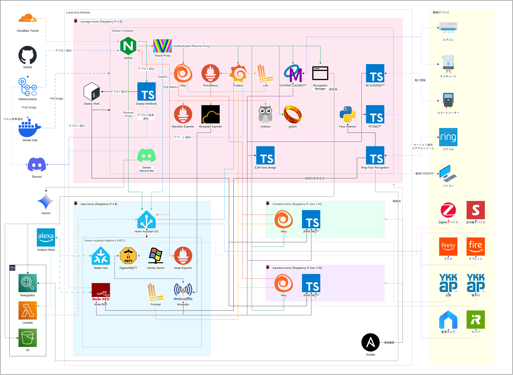

# Home Automation Architecture

## 表現ルール
- **外部 → 外部** の通信には `点線(2)` を適用する。
- **外部 → 内部** の通信には `破線(2)` を適用する。
- **内部 → 外部** の通信には `破線(1)` を適用する。
- **内部 ↔ 外部**(双方向通信)には `破線(3)` を適用する。
- **単方向の通信が2本ある場合(単方向×2)** は、重要なものを除き **双方向通信(破線(3))と同じ扱い** にする。
- **物理デバイスとの連携** には `点線(3)` を適用する。
- **線の色はアプリケーションのアイコン色に合わせる。** ただし、**送信側・受信側のどちらの色にするかは任意** とする。
